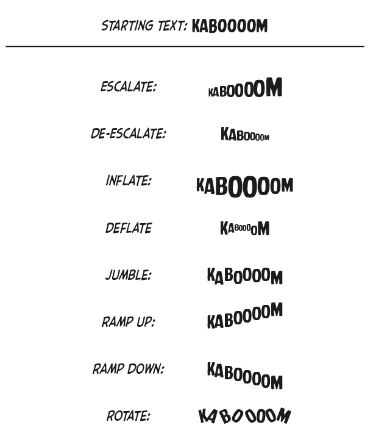

# Manga Scripts for Indesign

Herewith please avail yourself of this package of InDesign automations aimed at decreasing drudgery and imprecision when lettering Japanese comics in English.

## News

- Error handling is improved all around
- Most scripts--especially the text design ones--now consolidate their actions within a single undoable step
- Added document setup automation, including automatic placing of art

## Document Setup

**Add Guides and Pages Numbers** adds horizontal and vertical guides to the A-Master page, and creates a B-Master page with page numbers already placed.

**Initialize Document** should be run immediately after creating a new document at the desired trim size. This script:
1. Creates separate layers for guides, text, SFX, page numbers, retouching, design, and art, in that order.
2. Creates A- and B-master pages.
3. Places guides on the A-master page, and sets the B-master page to inhert the A-master.
4. Places art frames sized to the trim size on the A-master page.
5. Places automatic page numbers on the B-master page.
6. Prompts the user for a folder to search for page art assets (a folder of subfolders may be selected; the file-search algorithm is recursive)
7. Parses the art asset filenames to determine page order and book length
8. Adds a number of pages to the document equal to the highest identified page rounded up to the nearest 16-page signature.
9. Places each art file in the art frame of the corresponding page.

## Art Placement

**Create Master Page Art Frames** creates two empty graphics frames on the _A-Master_ master page, sized to the page size plus 1/8" bleed on the outer edges. This is useful for setting up container frames that page artwork will later be dropped into. The container frames will inherit various attributes from the frames on the master page, which is useful for bulk adjusting the scale and placement of the art frames throughout the document.

**Move All Graphics to Art Layer** moves all graphic frames in the document to the bottom-most layer.

**Move Page Graphics to Art Layer** moves all graphic frames on the current page to the bottom-most layer.

**Auto-Place Art From Folder** is extremely fragile, but currently does allow you to specify a folder from which art whose filenames matches a certain pattern will be automatically placed on the appropriate page. This is more for experimentation than it is for serious use.

**Set Master Art Scaling** adjust the master page graphic frames created using **Create Master Page Art Frames** in such a way as to affect the scaling of every image placed in one of the child graphic frames. This allows you to quickly find an appropriate scaling percentage for placed artwork _en masse_, without having to individually adjust every graphic frame. Please be advised of the following caveats:

- The scaling percentage is applied based on the current scaling equalling 100%. This means if you set a scaling percentage of 80%, then decide that's too small and  re-run the script with a percentage of 90%, the art will get smaller again, because you are specifying a size that's 90% as big as the size that resulted from the first 80% scaling.
- Because of certain assumptions the script makes, it will not be reliable unless used in conjunction with graphics frames placed using the **Create Master Page Art Frames** script.
- Depending on the art assets, individual pages may need to have their scaling factor adjusted. This script is meant to assist in arriving at a reasonable ballpark figure.
- Once you have adjusted an art frame manually, its relationship to the A-master art frame is broken and _it will no longer be affected by subsequent adjustments made with this script_.

## Guide Placement

Despite its reputation for fanciful panel layouts, a given manga typically establishes and adheres to fairly rigid margins. Placing guides approximately in line with these margins makes a variety of layout tasks much easier and more accurate.

**Add Guides** places guide lines on the _A-Master_ page, 1/2" from the trim on every side. 

**Nudge Horizontal Margins In** moves the guides at the top and bottom of each spread 1pt closer to each other each time it is run. **Nudge Horizontal Margins Out** does the opposite.

**Nudge Vertical Margins In** moves the guides at the left and right margins of both pages in a spread 1pt closer to each other each time it is run. **Nudge Vertical Margins Out** moves them away from each other.

## Pagination and Numbering

**Toggle Binding Direction** changes the binding direction of the document from right-to-left to left-to-right, and vice versa.

**Reverse Interior** reverses the spread order and binding direction of the entire document, i.e., it fixes Yen Press books. This takes a few seconds, so it displays a progress bar as it works. **Note:** A minor bug causes the contents of the very first and last pages to be mis-placed after reversal. Fixing this bug is not a high priority for yours truly, since manual correction is quite easy, and frankly I just reversed a whole volume of manga for you so I really think _you_ should be thanking _me_.

**Toggle Left Page Number** applies or un-applies the _B-Master_ page to the left-hand page of the current spread. The assumption here is that the letterer will have set up _B-Master_ to include an automatically-generated page number. Improving the script to simply do this for the letterer is a high priority. 

**Toggle Right Page Number** applies or un-applies the _B-Master_ page to the left-hand page of the current spread.

## Text Design

These are a collections of scripts to aid in designing more expressive sound effect subtitles.

**Escalate Characters** adjusts the text in a text frame such that each character is slightly larger than the character before it, such that the text appears to get "louder."

**De-Escalate Characters** adjusts the text in a text frame such that each character is slightly smaller than the character before it, such that the text appears to get "quieter."

**Enclose Text in Angle Brackets** wraps the text in a selected text frame in angle brackets, e.g. < >. 

**Enclose Text in Brackets** wraps the text in a selected text frame in square brackets, e.g. [ ].
 
**Inflate Characters** makes the text in the selected text box larger towards the middle, and smaller at the ends. 

**Deflate Characters** does the opposite, making the characters smaller towards the middle of the text, and larger at the ends

**Jumble Characters** adjusts the characters of the text up and down by alternating and slightly random amounts.

**Ramp Down Characters** adjusts the characters progressively lower with respect to the text's baseline for a stair-step effect.
**Ramp Up Characters** does the same, but upwards.

**Rotate Characters** rotates each character in the text box by a slight random amount, alternating clockwise and counterclockwise directions.

**Stack Characters** stacks all of the text in a frame vertically, with a line break between each character

## Et Cetera

**Create New R-to-L Document** creates a new document with the binding direction set right-to-left. This may be useful for older versions of InDesign where the document's binding direction cannot be changed after it's created.

**Create Translation Note Graphic** creates a thumbnail for excerpting a section of a page in translation endnotes. To use this script, select every object that will appear—even partially—in the thumbnail, then run the script. It will move a grouped and framed copy of the selected objects to the clipboard, and create a "Translation Note Graphic" object style if one does not already exist. You can use this style to give the thumbnails a stroke (I recommend a stroke size of 1 point). Note that there circumstances wherein thumbnails created this way can generate overset text errors, and the author hasn't quite figured out why, yet.

**Find Empty Text Frames** selects the next text frame that contains no text, and displays an alert if it finds none. This is useful for checking a finished book or section for missed lettering.

**Get Dimension** displays an alert with the current selection's geometric bounds. It is useful mostly as a diagnostic tool for scripting.

**Lock All Items** locks every item in the document.

**Unlock All Items** unlocks every item in the document.

**Select All On Left Page** selects all items on the left hand page of the current spread, irrespective of binding direction.

**Select All On Left Page** selects all items on the right hand page of the current spread, irrespective of binding direction.

**Match Art Frame to Page Size** takes the current selection and adjusts the bounds of any object on the bottom-most layer to match the page size plus 1/8" bleed on non-spine edges. It ignores objects that are not in the bottom-most layer. In conjunction with the **Select All On Left/Right Page** scripts, it's a useful tool for quickly adjusting the placement of a lettered page layout. It can also be run after selecting all items in a spread. This script also takes pains to correctly account for binding direction.

**Squeeze Line** reduces the horizontal scaling of the current line of text by 5%. This is useful for fitting text in narrow ballons. Note that the "current line" is defined as "whatever line the cursor is currently on." This script can be run repeatedly, although I generally avoid dipping below a scaling factor of 80%.

**Unbreak Text** removes all line breaks from the currently selected text frame. This is useful for quickly returning to a clean slate when trying to fit text into a constrained space.

## TODO

- Add script that moves all text frames to Text layer.
- Add setup scripts for common dialogue, caption, aside, and SFX paragraph styles
- Add setup scripts for common character styles
